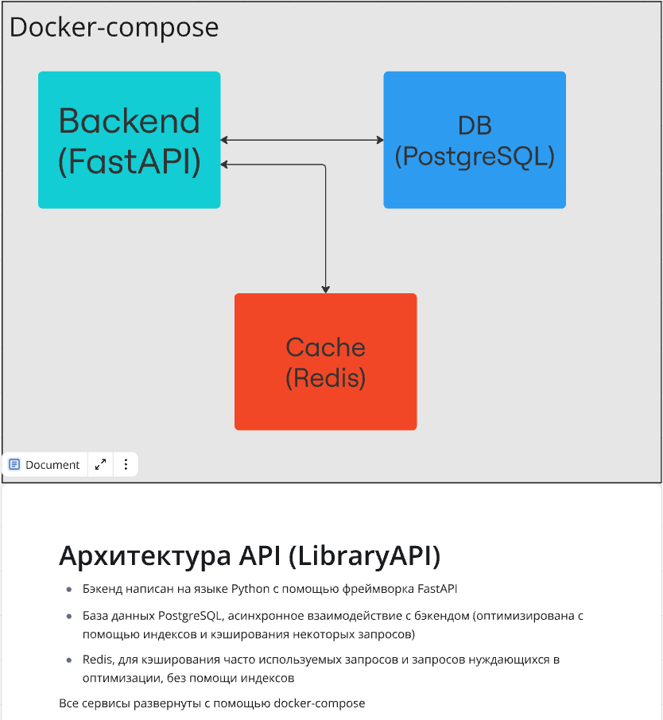
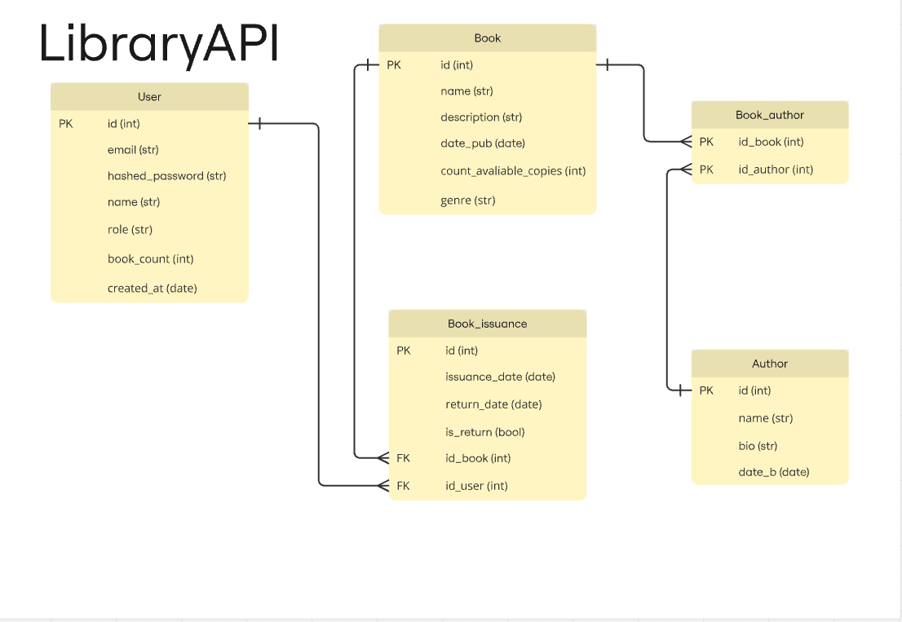

# LibraryAPI

#### Инструкция по разворачиваю приложения в локальной среде с помощью docker-compose:
1. Клонируем репозиторий: `git clone git@github.com:losdan77/LibraryAPI.git`
2. Переходим в репозиторий с приложением: `cd LibraryAPI/`
3. Собираем docker-compose: `docker compose build`
4. Запускаем docker-compose: `docker compose run`
---
#### Для просмотра swagger api переходим по адресу `http://localhost:8000/docs`, комментарии по пользованию api:
1. БД абсолютна пуста
2. Необходимо зарегестрировать пользователя, выбираем `role: reader` для создания читателя, `role: admin` для создания администартора, у них разные возможности согласно тестовому заданию (jwt токен сразу заноситься в куку, сделано для удобства, чтобы не использовать Bearer)
3. В коде есть комментарии к эндпоинтам, кто может использовать какие ручки согласно тестовому заданию
4. Согласно тестовому заданию, для книг и авторов написаны CRUD операции
5. Реализована выдача и возврат книг пользователю с ограничениями прописанными в тестовом задании
6. Соблюдены все дополнительные требования 
7. СОблюдены все технические требования
8. Соблюдены все дополнительные условия
9. Для оптимизации запросов в таблице `book_issuance` присутствуют два индекса, для остальных запросов по моему мнению использовать индексы бессмысленно, для их оптимизации можно применить кеширование с помощью redis, настройки redis прописаны в файле `main.py`, но я специально не применял кеширования к эндпоинтам, дабы облегчить проверку ручек (при изменении данных происходили бы коллизии)
---
#### В тестовом задании в дополнительных требованиях указанно, что необходимо реализовать юнит-тесты для основных эндпоинтов, для полноты тестирования эндпоинтов я принял решения написать интеграционные тесты, хоть и назвал папку с тестами `unit_tests`. Так же для удобства тестирования в docker-compose создается отдельная тестовая бд, инструкции по выполнению тестов:
1. Необходимо зайти в docker контейнер с api: `docker exec -it app_backend bash`
2. Запустить тесты написанные с помощью библиотеки pytest: `pytest`
---
#### Стек технологий и архитектура проекта:

---
#### Схема БД:
